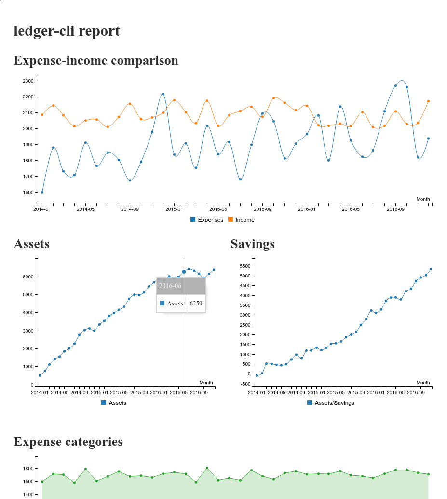

# ledger-cli-dashboard
This is a graphical reporting tool for [ledger](https://www.ledger-cli.org/), created using the desktop version of [just-dashboard](https://kantord.github.io/just-dashboard/). It is more intended as a starting point that you can extend and customize to match your own needs.



## Built-in features
- Observe long-term tendencies
- Chart expenses within a specific month
- Automatic currency exchange

## Dependencies
- yarn
- npm
- jq
- ledger

## Setup
```
./setup.sh
```

## Usage
### Customize account names
Edit `accounts.conf` to match your account names:

```
expenses_account=Expenses
income_account=Income
assets_account=Assets
savings_account=Assets/Savings
```


Edit `expense_categories.conf` to match your account names:

```
Food
Drinks
Rent
Services
Books
```

Note: Instead of ':' characters, you have to use '/' characters to access
sub-accounts.

### Display dashboard
```
./dashboard.sh book.txt USD
```

Replaced `USD` with your preferred output currency and `book.txt` with the path to your ledger file.

## Fake data
This repo includes a fake ledger file called 'fake_book.txt' and a Python script which you can use to generate your own fake data.

